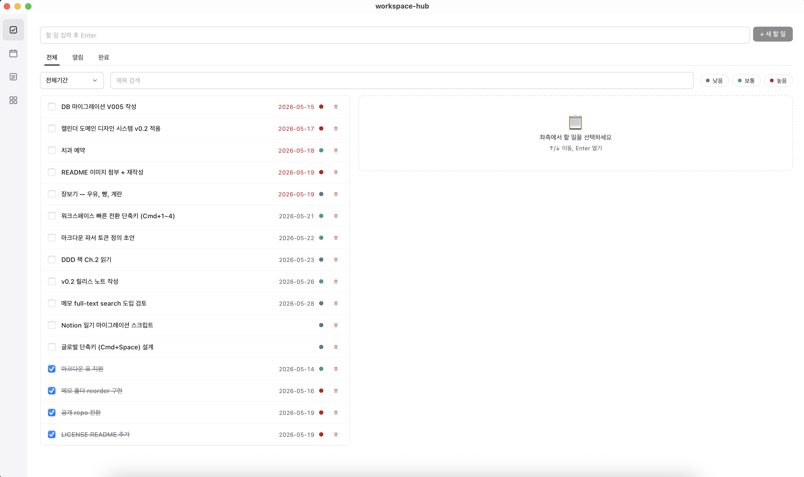
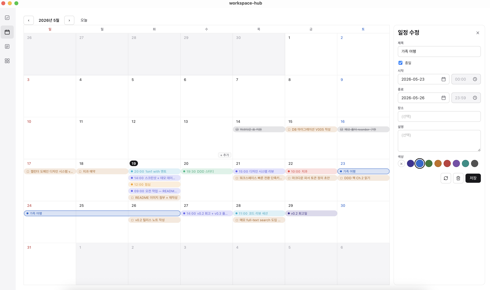
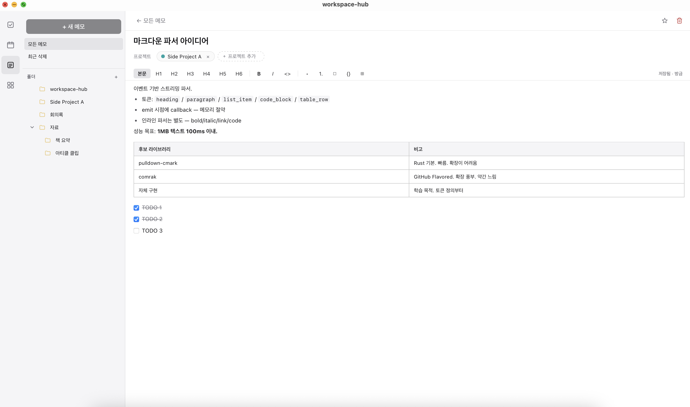
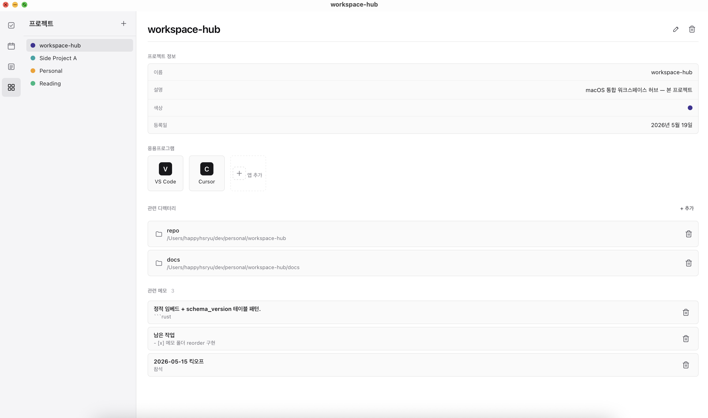

<p align="center">
  
</p>

<h1 align="center">workspace-hub</h1>

<p align="center">
  로컬 우선 macOS 데스크톱 앱 — <b>TODO · 캘린더 · 메모 · 워크스페이스</b>를 한 곳에.
</p>

<p align="center">
  <a href="./LICENSE"></a>
  
  
  
</p>

<p align="center">
  
</p>

---

## 왜?

흩어져 있어서 매번 새로 찾는다.

- **할 일 누락** — 어디에 적었는지 잊는다.
- **프로젝트 재진입 비용** — 같은 폴더·IDE·URL 묶음을 매번 다시 연다.
- **메모 표류** — 노트앱·메모지·README 초안 사이를 떠돈다.

외부 서비스에 의존하지 않고 로컬에서 빠르게 동작하는 통합 도구.

> 개인용으로 만든 도구이지만 같은 문제를 겪고 있다면 가져다 써도 좋습니다.

---

## Features

### TODO

마감일 · 우선순위 (low / mid / high) · 완료 토글. **overdue 는 빨강**으로 한눈에 — 위 메인 스크린샷 참고.

### Calendar

TODO 마감일과 자체 이벤트를 같은 월 · 주 · 일 뷰에 통합. 외부 캘린더(Google · iCloud) 연동은 의도적으로 빼고 앱 내부 캘린더만. 7색 팔레트로 구분.

<p align="center">
  
</p>

### Memo

폴더 트리 + 마크다운 본문(코드 블록 · 표 · 체크리스트 · 인용). 메모를 프로젝트에 매핑하면 Workspace 페이지에서 같이 보임.

<p align="center">
  
</p>

### Workspace

프로젝트별 **디렉터리 · `.app` · 매핑된 메모**를 한 카드 안에. 색상 dot 으로 구분, 더블클릭으로 Finder · 앱 바로 열기.

<p align="center">
  
</p>

---

## 설치

배포된 `.dmg` 를 제공하지 않습니다. **저장소를 clone 해서 본인 머신에서 빌드**하는 방식입니다. 본인이 직접 빌드한 앱은 macOS Gatekeeper 의 quarantine 대상이 아니라 별도 우회 명령 없이 바로 실행됩니다.

### 사전조건 (한 번만)

```bash
brew install pnpm
curl --proto '=https' --tlsv1.2 -sSf https://sh.rustup.rs | sh   # rustup
xcode-select --install                                            # 이미 있으면 skip
```

### 설치 — 권장 (`install.sh`)

```bash
git clone https://github.com/HSRyuuu/workspace-hub.git
cd workspace-hub
./install.sh
```

`install.sh` 가 사전조건 확인 → 의존성 설치 → `pnpm tauri build` → `/Applications` 으로 복사까지 한 번에 처리합니다. 첫 빌드 기준 수 분 소요.

### 설치 — 수동

```bash
git clone https://github.com/HSRyuuu/workspace-hub.git
cd workspace-hub/app
pnpm install
pnpm tauri build
cp -R src-tauri/target/release/bundle/macos/workspace-hub.app /Applications/
```

설치 후 Launchpad / Finder 에서 `workspace-hub` 검색 → 더블클릭.

> 코드사이닝 · 노타라이즈(Apple Developer Program $99/년)는 개인 프로젝트 범위라 생략했습니다.

---

## 데이터

모든 데이터는 **로컬 SQLite** 에 저장됩니다. 외부 네트워크 호출 없음.

```
~/.workspace-hub/workspace-hub.sqlite
```

- 백업: 위 폴더 그대로 복사
- 완전 삭제: 앱 + `~/.workspace-hub/` 디렉터리 함께 제거

---

## 구조

| 영역 | 위치 | 설명 |
|---|---|---|
| Desktop Shell | `app/` | Tauri v2 + React + TypeScript |
| 도메인 · DB 로직 | `core/` | `workspace-hub-core` crate — 단일 진실 원천 |
| CLI | `cli/` | `workspace-hub` 바이너리 — `core` 를 감싼 JSON 출력 |

```
[React UI] ──IPC──► [Tauri Rust Shell] ──fn call──► [core lib] ──► [SQLite]
                                                         ▲
                          [Claude Code skills] ──spawn──►[CLI bin]┘
```

상세 코드 라우팅은 [`docs/SOURCE_MAP.md`](./docs/SOURCE_MAP.md), 디자인 토큰은 [`docs/DESIGN.md`](./docs/DESIGN.md), 결정 이력은 [`docs/ADR.md`](./docs/ADR.md).

---

## 의도적 비-목표

- "올인원 생산성 도구"가 아닙니다. Notion · Obsidian · Linear 의 대체재가 아닙니다.
- 동기화 · 클라우드 · 모바일 · 외부 캘린더 연동 — **범위 밖**.
- 본인이 매일 쓰는 도구를 빠르게. 범용 사용자 요구는 고려하지 않음.

---

## 라이선스

[MIT](./LICENSE)
